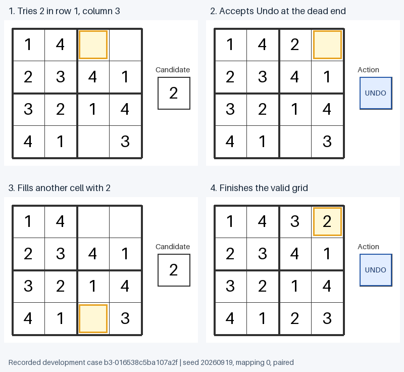

# Learn a visible Undo action

**Result: new Undo learning and development recovery pass; retention fails.**
Every paired condition learned all 16 Undo associations and solved 159/160
development puzzles, including 63/64 traps. Controls scored 0–23.33% on Undo
balanced accuracy. Old conflict rejections became timeouts, so Step 5 remains
incomplete. The predeclared protocol follows; detailed results are below it.

The frozen baseline is preserved at `649e178`. This separate development
experiment trains a new state/action association through the same 7,835
existing KC→MBON plastic edges. It keeps the complete connectome, local learning
rule, currents, 500 ms observation and fixed decoder unchanged.

## What is supplied and what is learned

The display shows a highlighted target and a visible UNDO operation. Four
generic peer-template presence bits select one of 16 equally sized groups of
16 sensory KCs. These 256 KCs exclude every KC in the original placement bank.
Selection uses original anatomical contacts to both outputs, with a balanced
partition and no neural task outcomes. All 16 presence patterns are routed
identically in form; the encoder never computes a dead-end label.

**This representation supplies a lookup table of distinguishable contexts.**
The fly must learn their action associations: accept Undo when all four peer
symbols are present, reject it for the other 15 patterns. Every pattern is
trained, so successful recall is not learned Boolean composition or transfer
to unseen neural patterns. Visual recognition and target attention remain
engineered. No new edges or fitted output layer are introduced.

## Frozen protocol before neural training

- Two inherited Step 3 histories × both output mappings × four arms. Every arm
  within a condition starts from the same **paired** Step 3 memory. These warm
  controls isolate the new training, rather than the whole previous curriculum.
- Eight epochs of 30 trials. Each epoch presents the all-four pattern 15 times
  and every other pattern once. Cue order is seeded and saved before training.
- Every trial receives the existing bidirectional teaching sequence: cue 500 ms
  frozen; target DAN 200 ms learning; passive 250 ms; electrical reset retaining
  memory; opposite DAN 200 ms frozen; cue 500 ms learning; passive 250 ms.
- Frozen controls receive the correct pulses with frozen weights. No-feedback
  controls omit both pulses but retain active learning and passive windows.
  Inconsistent controls shuffle an exactly equal number of both labels over
  **all occurrences of each pattern**: 60/60 for the repeated pattern and 4/4
  for every other pattern. Both pulsed compartments receive equal total dose.
- No response-dependent stopping, rehearsal, old-synapse clamping or restoration
  during training. Existing memory undergoes about 288 simulated seconds of
  passive relaxation in active windows, so retention is a substantive test.
- Evaluate all 121 physical inputs (105 placement plus 16 Undo) from electrical
  reset with memory frozen. Verify full-network weight hashes across each batch.
  Restore inherited W/u/w for stage erasure, then original memory for full
  erasure; remeasure all 16 Undo and 16 familiar placement inputs exactly against
  their references. Check all nonplastic weights independently.

The new-association gate requires balanced accuracy ≥90%, each class recall
≥85%, and ≥25 percentage points over every warm control, in all four conditions.
Retention requires all 16 familiar placement actions to remain correct.
Report the broader placement occupancy scores separately, preserving the failed
001 prerequisites. Timeouts count as errors; the 15:1 Undo class imbalance makes
plain accuracy inadequate.

## Sequential recovery

Use the same 160 development puzzles and both predeclared placement policies.
Scan currently empty cells in row-major order, trying digits 1 through 4 and
immediately committing the first neural acceptance. Always offer Undo after
that digit cycle, including after an accepted placement. Its highlighted target
can therefore be filled. Accepted neural Undo pops the latest nongiven placement;
then the fixed global scan continues. No host legality checks, automatic Undo,
solution access, tried-candidate memory or per-branch cursor selects actions.

Stop when full, at 16 sweeps or 1,024 decisions, or when an identical board and
stack recur at a sweep boundary. The last condition only ends a deterministic
loop: frozen, reset inference and an identical menu would repeat forever.
It supplies no alternative action. Grade validity only after the episode.
Save every image/input reference, neural action and board/stack transition in
`episodes.jsonl.gz`; identical physical inputs explicitly reuse measured frozen
responses and do not count as independent neural observations.

Perfect placement and Undo judgments solve 159/160 development cases under this
interface: all easy cases, 32/32 three-blank traps and 31/32 four-blank traps.
`b4-00cae9940eafa634` loops. This data-only interface check establishes feasibility,
not neural success. Require actual neural solve rates ≥90% in **each** available
blank-count/easy-or-trap stratum; report both policies.

This development experiment cannot complete Step 5. Successful association
recall, old-skill retention, robust placement, actual recovery and reserved-family
confirmation are separate requirements. The reserved puzzles are not evaluated
here. Two deterministic saved histories are not independent biological samples.

```sh
.venv/bin/python learn_undo.py --out experiments/level-05/002-learned-undo/development
```

Freeze the source and this protocol in Git before running. Preserve all outcomes,
including failed retention or controls, before choosing another experiment.

## Recorded results

Source/protocol were committed at `a3f692d` before the run. All 16 declared arms
finished in 1,315.41 seconds; none were stopped or altered after an early result.
The [raw summary](development/summary.json) retains all per-arm placement and
sequence measurements, and every trained memory is saved alongside it.

| History | Mapping | Paired Undo balanced accuracy | Frozen | No feedback | Inconsistent | Familiar placement judgments retained |
| --- | ---: | ---: | ---: | ---: | ---: | ---: |
| 20260919 | 0 | 100% | 13.33% | 13.33% | 23.33% | 12/16 |
| 20260919 | 1 | 100% | 0% | 0% | 0% | 7/16 |
| 20260920 | 0 | 100% | 13.33% | 13.33% | 23.33% | 12/16 |
| 20260920 | 1 | 100% | 0% | 0% | 0% | 5/16 |

The worst paired Undo margin beyond the fixed decision threshold is 3.375 Hz.
Stage erasure exactly restores the inherited responses; full erasure exactly
restores original baseline responses. Frozen controls retain their inherited
memory exactly. These checks support learning in the plastic synapses rather
than an already solved operation or a changing decoder.

Every paired condition, under **both** placement policies, produces:

| Development stratum | Solved |
| --- | ---: |
| Two blanks, easy | 32/32 |
| Three blanks, easy | 32/32 |
| Three blanks, trap | 32/32 |
| Four blanks, easy | 32/32 |
| Four blanks, trap | 31/32 |

This is **159/160 distinct puzzles (99.375%)**, including **63/64 traps (98.4375%)**,
replayed under four memories and two policies. The same puzzle
`b4-00cae9940eafa634` fails each time, returning to its initial board and empty
stack after 17 decisions and two Undo operations. It remains a failure.
The baseline without Undo solved zero traps. Warm controls in this experiment
solve 0–13 of the 64 traps, depending on mapping/policy/history. Their occasional
successes are not evidence of learning the intended Undo association: erroneous
Undo accepts or missed placement accepts can happen to avoid a bad branch.

In the example below, the fly accepts 2 at row 1/column 3, then accepts Undo
when row 1/column 4 has no locally legal candidate. The fixed scan later fills
row 4/column 3 with 2. On the next sweep, the reopened top cell receives 3 and
the last top cell receives 2. The final Undo offer is declined. Every displayed
frame matches its recorded observation hash; no action was filtered or repaired.



## Why retention failed

All 909 old learned edges follow the exact passive relaxation predicted by the
unchanged rule during 288 simulated seconds of active memory windows:

`u_final / u_initial = exp(-288/1800) = 0.852143789`.

Across all nonfrozen conditions, old u/w values match the analytic decay model
within 1.5e-13. Paired training changes 892 new Undo edges from baseline;
inconsistent teaching changes those edges without learning the intended labels;
no-feedback changes none of them. The other 6,034 plastic edges remain unchanged.
No new Undo KCs fire during the familiar placement probes. The old-memory
regression is therefore explained by passive relaxation, with no observed
cross-task associative drive needed to explain it.

The lost familiar decisions are **conflict rejections that become timeouts**;
all four familiar legal accepts survive in every condition. The menu advances
to the next digit after either rejection or timeout, so puzzle solve rates can
remain high while the explicit judgment test deteriorates. We retain the strict
retention failure instead of relabeling timeouts as correct rejections.

## Audit and stage status

Two independent data-only verifiers passed. The [neural audit](audit-neural.json)
checks 32 artifact hashes, checkpoint/source/input provenance, all 3,840 training
trials, 3,565 frozen evaluations, 53 complete weight checks, teaching controls,
erasures and analytic memory decay. The [episode audit](audit-episodes.json)
independently replays all 5,120 episodes and **79,802 action events**, verifies
menu/board/stack mechanics, recomputes metrics and gates, and checks 432 canonical
plus 386 representative episode image encodings. The reports and figure are
bound to the raw summary in [audit-files-sha256.json](audit-files-sha256.json).

| Gate | Result |
| --- | --- |
| New Undo association versus warm controls | Pass, all four conditions |
| Development recovery, each stratum and both policies | Pass |
| Familiar placement retention | Fail, all four paired conditions |
| Prior variable-peer prerequisites | Failed in 001; remain unresolved |
| Reserved-family confirmation | Not run |
| Full Step 5 | **Incomplete** |

These results establish new learned state/action associations and assisted
development-puzzle recovery. They do not establish novel-pattern generalization,
independent biological replication, a learned search algorithm, or general Sudoku.
A useful next controlled experiment is less teaching exposure: online decisions
in the first paired condition were already correct throughout epochs 2–8, but
no earlier frozen checkpoint or retention pass was measured. Shorter training
therefore remains a hypothesis to test, followed by the unresolved placement
prerequisites and reserved-family confirmation. No Step 6 experiment was started.
